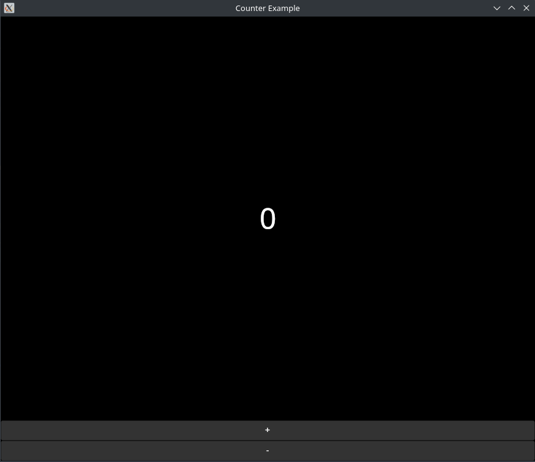

# Use Avalonia.FuncUI in Fsi

### Lets go

## First create new .fsx file and write counter app code
### imports
```f#
open Avalonia
open Avalonia.Controls.ApplicationLifetimes
open Avalonia.Themes.Fluent
open Avalonia.FuncUI.Hosts
open Avalonia.Controls
open Avalonia.FuncUI
open Avalonia.FuncUI.DSL
open Avalonia.Layout
```
### Main view
```f#
    module Main =

    let view () =
        Component(fun ctx ->
            let state = ctx.useState 0

            DockPanel.create [
                DockPanel.children [
                    Button.create [
                        Button.dock Dock.Bottom
                        Button.onClick (fun _ -> state.Set(state.Current - 1))
                        Button.content "-"
                        Button.horizontalAlignment HorizontalAlignment.Stretch
                        Button.horizontalContentAlignment HorizontalAlignment.Center
                    ]
                    Button.create [
                        Button.dock Dock.Bottom
                        Button.onClick (fun _ -> state.Set(state.Current + 1))
                        Button.content "+"
                        Button.horizontalAlignment HorizontalAlignment.Stretch
                        Button.horizontalContentAlignment HorizontalAlignment.Center
                    ]
                    TextBlock.create [
                        TextBlock.dock Dock.Top
                        TextBlock.fontSize 48.0
                        TextBlock.verticalAlignment VerticalAlignment.Center
                        TextBlock.horizontalAlignment HorizontalAlignment.Center
                        TextBlock.text (string state.Current)
                    ]
                ]
            ]
        )
```
### Init main window
```f#
type MainWindow() =
    inherit HostWindow()
    do
        base.Title <- "Counter Example"
        base.Content <- Main.view ()

type App() =
    inherit Application()

    override this.Initialize() =
        this.Styles.Add (FluentTheme())
        this.RequestedThemeVariant <- Styling.ThemeVariant.Dark

    override this.OnFrameworkInitializationCompleted() =
        match this.ApplicationLifetime with
        | :? IClassicDesktopStyleApplicationLifetime as desktopLifetime ->
            desktopLifetime.MainWindow <- MainWindow()
        | _ -> ()
```
### And main function
```f#
module Program =

    let main(args: string[]) =
        AppBuilder
            .Configure<App>()
            .UsePlatformDetect()
            .UseSkia()
            .StartWithClassicDesktopLifetime(args)
```
## How to use in fsi?
## Easy!!
```f#
#r "nuget: Avalonia.Desktop"
#r "nuget: Avalonia.FuncUI"
#r "nuget: Avalonia.Themes.Fluent"

...

Program.main fsi.CommandLineArgs
```
### #r use for import dependencies

### And run main function on end with program arguments
```shell
dotnet fsi counter.fsx
```
